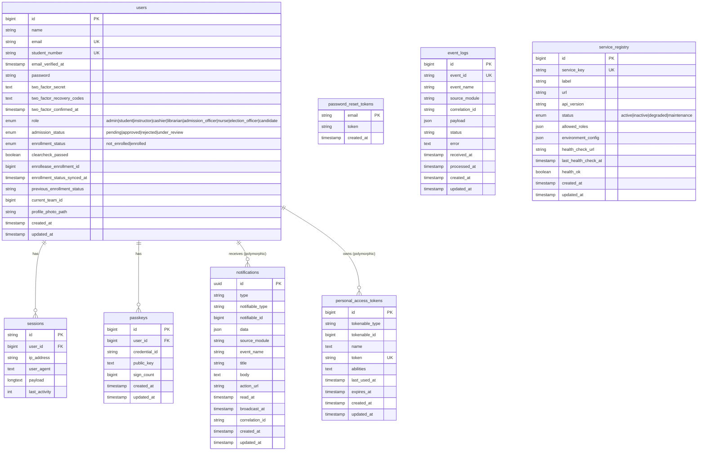

# ERD — DEORIS Main Portal (deoris_identity_db)

## Database Info
| Property | Value |
|---|---|
| **Database Name** | `deoris_identity_db` |
| **Connection** | MySQL / 127.0.0.1:3306 |
| **App URL** | https://deoris.test |
| **Role** | Central Identity & Event Hub |

## Key Relationships to Modules
| Module | Link Field | Direction |
|---|---|---|
| entryEase | `users.id` ↔ `applicants.deoris_user_id` | DEORIS → entryEase |
| EnrollEase | `users.enrollease_enrollment_id` ↔ `enrollments.id` | EnrollEase → DEORIS |
| gradeTrack | `users.id` ↔ `students.portal_user_id` | DEORIS → gradeTrack |
| asssesspay | `users.id` ↔ `students.portal_user_id` | DEORIS → asssesspay |
| LibrarySys | `users.id` ↔ `visits/transactions.deoris_user_id` | DEORIS → LibrarySys |
| taskflow | `users.id` ↔ `submissions.portal_user_id` | DEORIS → taskflow |
| VoteSys | `users.id` ↔ `votes.voter_external_id` | DEORIS → VoteSys |
| MediTrack | `users.id` ↔ `students.external_id` | DEORIS → MediTrack |
| ClearCheck | `users.id` ↔ `students.user_id` | DEORIS → ClearCheck |
| carrerConnect | `users.id` ↔ `faculty_users.sso_id` | DEORIS → carrerConnect |
| All Modules | EventHub HTTP POST `/api/events/ingest` | Bidirectional |
