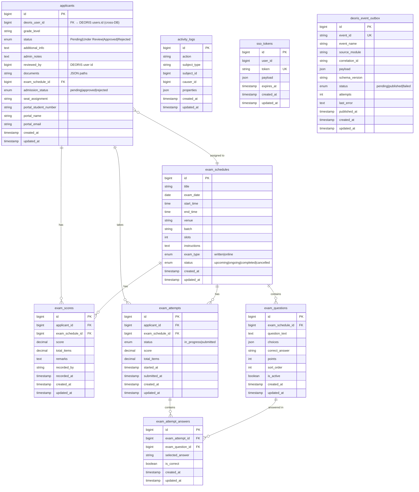

# ERD — entryEase (SQLite / entry_ease_db)

## Database Info
| Property | Value |
|---|---|
| **Database Name** | `SQLite` (local file, dev) / `entry_ease_db` (MySQL commented) |
| **Connection** | SQLite (default) |
| **App URL** | https://entryease.deoris.test |
| **Role** | Admission & Entrance Exam Management |

## Cross-DB Links
| Field | References |
|---|---|
| `applicants.deoris_user_id` | `deoris_identity_db.users.id` (application-level, no FK) |
| `applicants.reviewed_by` | `deoris_identity_db.users.id` (admission officer) |
| EventHub outbox → | `deoris_identity_db.event_logs` via HTTP POST |
