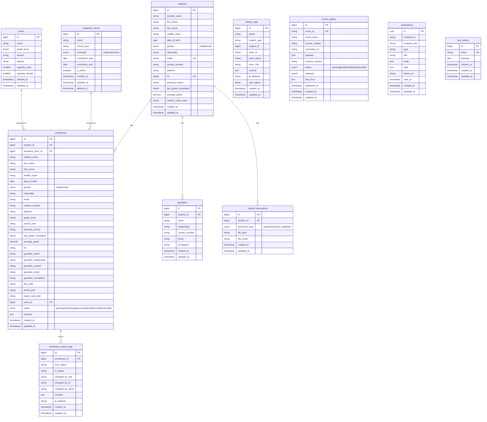

# ERD — EnrollEase (enrolldb)

## Database Info
| Property | Value |
|---|---|
| **Database Name** | `enrolldb` |
| **Connection** | MySQL / 127.0.0.1:3306 |
| **App URL** | https://enrollease.deoris.test |
| **Role** | Student Enrollment Management |

## Cross-DB Links
| Field | References |
|---|---|
| `enrollments.student_id` | `enrolldb.students.id` (local) |
| `event_outbox` → DEORIS | `deoris_identity_db.event_logs` via HTTP POST |
| DEORIS `users.enrollease_enrollment_id` | `enrolldb.enrollments.id` (application-level) |
| asssesspay pulls enrollment data | via REST API with API key |
| gradeTrack syncs enrollment | via ENROLLEASE_API_KEY webhook |

## Views & Procedures
| Object | Type | Purpose |
|---|---|---|
| `v_enrollment_stats` | VIEW | Enrollment counts by school year & grade |
| `v_section_capacity` | VIEW | Room capacity vs enrolled counts |
| `sp_enrollment_summary` | PROCEDURE | Summary by school year |
| `trg_enrollment_status_audit` | TRIGGER | Auto-log status changes |
