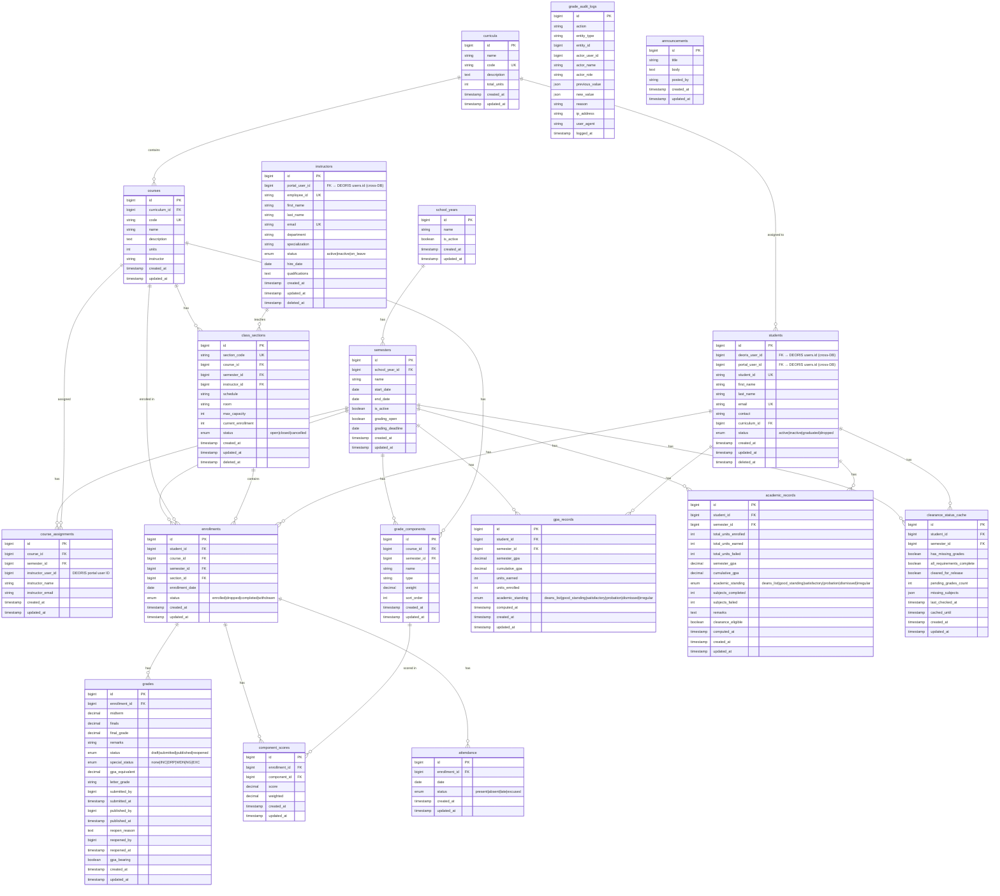

# ERD — gradeTrack (gradetrack)

## Database Info
| Property | Value |
|---|---|
| **Database Name** | `gradetrack` |
| **Connection** | MySQL / 127.0.0.1:3306 |
| **App URL** | https://gradetrack.deoris.test |
| **Role** | Academic Grading & Records |

## Cross-DB Links
| Field | References |
|---|---|
| `students.deoris_user_id` / `portal_user_id` | `deoris_identity_db.users.id` |
| `instructors.portal_user_id` | `deoris_identity_db.users.id` |
| `course_assignments.instructor_user_id` | `deoris_identity_db.users.id` |
| EnrollEase sync | via ENROLLEASE_API_KEY (pull-based) |
| ClearCheck queries | `clearance_status_cache` via API |

## Views & Procedures
| Object | Type | Purpose |
|---|---|---|
| `v_student_grade_summary` | VIEW | Per-student grade overview |
| `v_course_statistics` | VIEW | Course-level grade stats |
| `sp_calculate_gpa` | PROCEDURE | GPA computation |
| `trg_grade_audit` | TRIGGER | Immutable grade change log |
