# ERD — asssesspay / AssessPay (assespaydb)

```mermaid
erDiagram
    students {
        bigint id PK
        string portal_user_id "FK → DEORIS users.id (cross-DB)"
        string student_id UK
        string name
        string program
        string year_level
        string email
        string status
        timestamp created_at
        timestamp updated_at
        timestamp deleted_at
    }

    tuition_fees {
        bigint id PK
        int grade_level
        string school_year
        decimal tuition_fee
        decimal misc_fee
        decimal other_fee
        decimal total_fee "stored as computed"
        boolean is_active
        timestamp created_at
        timestamp updated_at
    }

    billing_accounts {
        bigint id PK
        bigint student_id FK
        string account_number UK
        string currency
        enum status "active|suspended|closed"
        timestamp created_at
        timestamp updated_at
        timestamp deleted_at
    }

    tuition_records {
        bigint id PK
        bigint billing_account_id FK
        bigint student_id FK
        string school_year
        string term
        string description
        decimal tuition_amount
        decimal misc_amount
        decimal other_amount
        decimal total_amount
        enum status "pending|processing|paid|partially_paid|overdue|cancelled|refunded"
        date due_date
        timestamp created_at
        timestamp updated_at
        timestamp deleted_at
    }

    billings {
        bigint id PK
        string billing_number UK
        bigint student_id FK
        int grade_level
        string school_year
        decimal tuition_fee
        decimal misc_fee
        decimal other_fee
        decimal total_fee
        decimal amount_paid
        decimal balance
        enum status "unpaid|partial|paid"
        string enrollment_status
        string source
        string student_name
        timestamp created_at
        timestamp updated_at
    }

    balances {
        bigint id PK
        bigint billing_account_id FK
        bigint student_id FK
        decimal total_assessed
        decimal total_paid
        decimal current_balance
        timestamp last_recalculated_at
        timestamp created_at
        timestamp updated_at
    }

    payment_methods {
        bigint id PK
        string code UK
        string name
        boolean is_active
        timestamp created_at
        timestamp updated_at
    }

    payments {
        bigint id PK
        bigint student_id FK
        bigint billing_account_id FK
        bigint tuition_record_id FK
        bigint payment_method_id FK
        string receipt_number UK
        decimal amount
        enum status "pending|processing|paid|partially_paid|overdue|cancelled|refunded"
        string method
        string reference_number
        string submitted_by_portal_id "DEORIS user id"
        string confirmed_by_portal_id "DEORIS user id"
        timestamp paid_at
        timestamp confirmed_at
        uuid correlation_id
        timestamp created_at
        timestamp updated_at
        timestamp deleted_at
    }

    official_receipts {
        bigint id PK
        bigint payment_id FK
        bigint student_id FK
        string receipt_number UK
        decimal amount
        string issued_by_portal_id "DEORIS user id"
        timestamp issued_at
        json metadata
        timestamp created_at
        timestamp updated_at
        timestamp deleted_at
    }

    financial_transactions {
        bigint id PK
        bigint billing_account_id FK
        bigint student_id FK
        bigint payment_id FK
        string transaction_type
        decimal debit
        decimal credit
        decimal running_balance
        string reference
        string performed_by_portal_id "DEORIS user id"
        string role
        timestamp created_at
        timestamp updated_at
    }

    assessments {
        bigint id PK
        bigint student_id FK
        decimal tuition
        decimal misc
        decimal lab
        decimal total
        decimal paid
        decimal balance
        enum status "paid|pending|overdue"
        timestamp created_at
        timestamp updated_at
    }

    fee_assessments {
        bigint id PK
        bigint student_id FK
        decimal tuition_fee
        decimal misc_fee
        decimal lab_fee
        decimal total_fee
        decimal amount_paid
        decimal balance
        enum status "pending|paid|overdue"
        timestamp created_at
        timestamp updated_at
    }

    promissory_notes {
        bigint id PK
        bigint student_id FK
        decimal amount
        date due_date
        string status
        timestamp created_at
        timestamp updated_at
    }

    enrollments {
        bigint id PK
        string student_name
        string email
        tinyint grade_level
        string school_year
        bigint room_id FK
        enum status "pending|verified|approved|rejected|enrolled|cancelled"
        text remarks
        timestamp created_at
        timestamp updated_at
    }

    rooms {
        bigint id PK
        string name
        tinyint grade_level
        string section
        string adviser
        smallint capacity_male
        smallint capacity_female
        timestamp created_at
        timestamp updated_at
    }

    payment_audit_logs {
        bigint id PK
        bigint payment_id FK
        string action
        string actor_portal_id "DEORIS user id"
        string actor_role
        json before_state
        json after_state
        string ip_address
        text user_agent
        timestamp created_at
        timestamp updated_at
    }

    activity_logs {
        bigint id PK
        string log_name
        string event
        string subject_type
        bigint subject_id
        string causer_portal_id "DEORIS user id"
        string causer_role
        json properties
        string ip_address
        timestamp created_at
        timestamp updated_at
    }

    event_outbox {
        uuid id PK
        string event_name
        string source_service
        json payload
        string schema_version
        uuid correlation_id
        string signature
        string nonce
        bigint timestamp
        enum status "pending|published|failed"
        tinyint attempts
        timestamp published_at
        text last_error
        timestamp created_at
        timestamp updated_at
    }

    students ||--o{ billing_accounts : "has"
    students ||--o{ tuition_records : "has"
    students ||--o{ billings : "has"
    students ||--o{ balances : "has"
    students ||--o{ payments : "makes"
    students ||--o{ official_receipts : "receives"
    students ||--o{ financial_transactions : "has"
    students ||--o{ assessments : "has"
    students ||--o{ fee_assessments : "has"
    students ||--o{ promissory_notes : "has"
    billing_accounts ||--o{ tuition_records : "contains"
    billing_accounts ||--|| balances : "has"
    billing_accounts ||--o{ financial_transactions : "has"
    tuition_records ||--o{ payments : "paid via"
    payments ||--o{ official_receipts : "generates"
    payments ||--o{ payment_audit_logs : "audited"
    payments ||--o{ financial_transactions : "creates"
    payment_methods ||--o{ payments : "used in"
    rooms ||--o{ enrollments : "contains"
```

## Database Info
| Property | Value |
|---|---|
| **Database Name** | `assespaydb` |
| **Connection** | MySQL / 127.0.0.1:3306 |
| **App URL** | https://assesspay.deoris.test |
| **Role** | Fee Assessment & Payment Processing |

## Cross-DB Links
| Field | References |
|---|---|
| `students.portal_user_id` | `deoris_identity_db.users.id` (application-level) |
| `payments.submitted_by_portal_id` | `deoris_identity_db.users.id` |
| `payments.confirmed_by_portal_id` | `deoris_identity_db.users.id` |
| EnrollEase API pull | `enrolldb.enrollments` via REST (ENROLLEASE_API_KEY) |
| `event_outbox` → DEORIS | `deoris_identity_db.event_logs` via HTTP POST |
