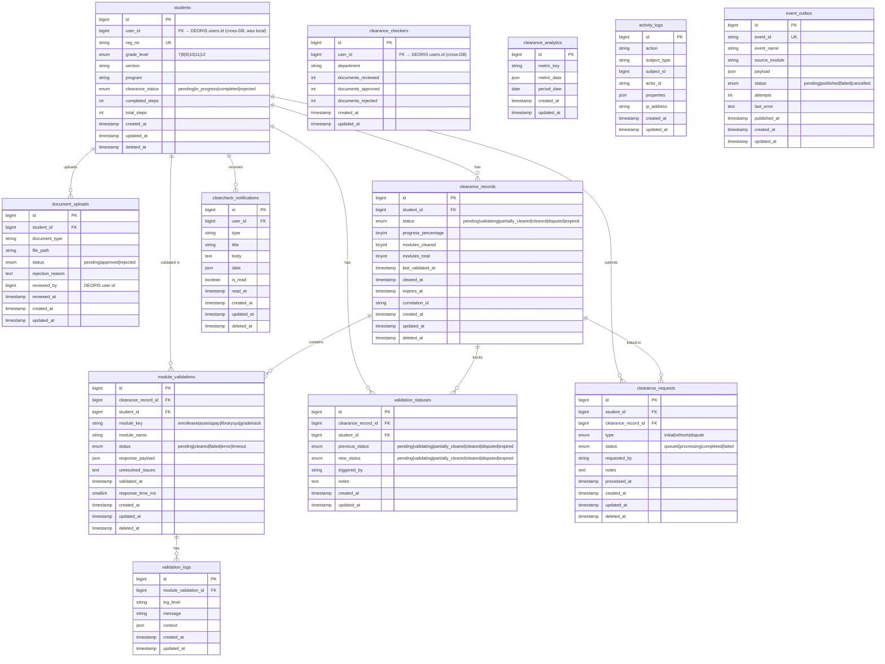

# ERD — ClearCheck (cleardb)

## Database Info
| Property | Value |
|---|---|
| **Database Name** | `cleardb` |
| **Connection** | MySQL / 127.0.0.1:3306 |
| **App URL** | https://clearcheck.deoris.test |
| **Role** | Student Clearance Validation (multi-module) |

## Cross-DB Links
| Field | References |
|---|---|
| `students.user_id` | `deoris_identity_db.users.id` (migrated from local) |
| `module_validations.module_key = 'enrollease'` | Queries `enrolldb` via REST API |
| `module_validations.module_key = 'assesspay'` | Queries `assespaydb` via REST API |
| `module_validations.module_key = 'librarysys'` | Queries `library` via REST API |
| `module_validations.module_key = 'gradetrack'` | Queries `gradetrack` via REST API |
| `event_outbox` → DEORIS | `deoris_identity_db.event_logs` via HTTP POST |
| DEORIS `users.clearcheck_passed` | Updated via EventHub when clearance = 'cleared' |
