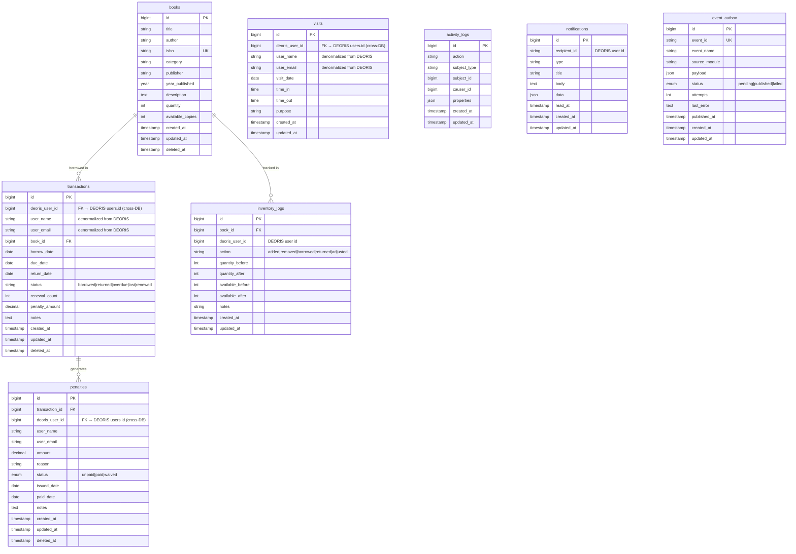

# ERD — LibrarySys (library)

## Database Info
| Property | Value |
|---|---|
| **Database Name** | `library` |
| **Connection** | MySQL / 127.0.0.1:3306 |
| **App URL** | https://librarysys.deoris.test |
| **Role** | Library Book Management & Borrowing |

## Cross-DB Links
| Field | References |
|---|---|
| `visits.deoris_user_id` | `deoris_identity_db.users.id` (migrated from local users table) |
| `transactions.deoris_user_id` | `deoris_identity_db.users.id` |
| `penalties.deoris_user_id` | `deoris_identity_db.users.id` |
| ClearCheck queries | `transactions` & `penalties` via REST API |
| `event_outbox` → DEORIS | `deoris_identity_db.event_logs` via HTTP POST |

## Notes
- Local `users` table was **dropped** in migration `2026_05_26_000010` — identity fully delegated to DEORIS
- User name/email are **denormalized** into `visits` and `transactions` for query performance
