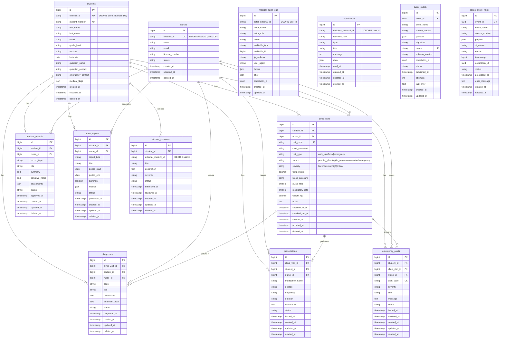

# ERD — MediTrack (meditrack_db)

## Database Info
| Property | Value |
|---|---|
| **Database Name** | `meditrack_db` |
| **Connection** | MySQL / 127.0.0.1:3306 |
| **App URL** | https://meditrack.deoris.test |
| **Role** | School Clinic & Health Records |

## Cross-DB Links
| Field | References |
|---|---|
| `students.external_id` | `deoris_identity_db.users.id` (SSO identity) |
| `nurses.external_id` | `deoris_identity_db.users.id` (SSO identity) |
| `deoris_event_inbox` | Receives events from `deoris_identity_db.event_logs` |
| `event_outbox` → DEORIS | `deoris_identity_db.event_logs` via HTTP POST |

## Views & Procedures
| Object | Type | Purpose |
|---|---|---|
| `clinic_visit_analytics` | VIEW | Daily visit stats by status/severity |
| `diagnosis_trends` | VIEW | Monthly diagnosis frequency |
| `sp_student_health_statistics` | PROCEDURE | Per-student health summary |
| `trg_clinic_visit_emergency` | TRIGGER | Auto-create emergency alert on critical visit |
