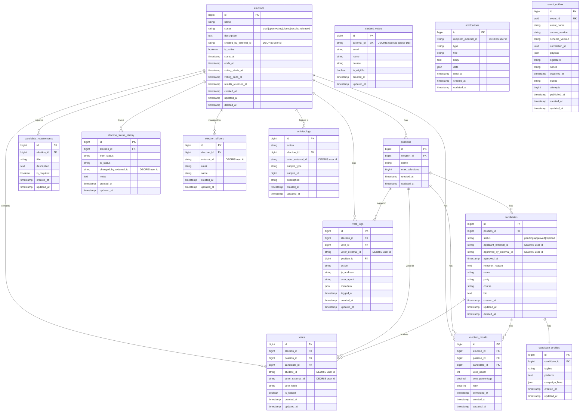

# ERD — VoteSys (votesys_db)

## Database Info
| Property | Value |
|---|---|
| **Database Name** | `votesys_db` |
| **Connection** | MySQL / 127.0.0.1:3306 |
| **App URL** | https://votesys.deoris.test |
| **Role** | Student Election & Voting System |

## Cross-DB Links
| Field | References |
|---|---|
| `student_voters.external_id` | `deoris_identity_db.users.id` (SSO identity) |
| `votes.voter_external_id` | `deoris_identity_db.users.id` |
| `candidates.applicant_external_id` | `deoris_identity_db.users.id` |
| `election_officers.external_id` | `deoris_identity_db.users.id` |
| `event_outbox` → DEORIS | `deoris_identity_db.event_logs` via HTTP POST |
| DEORIS `users.election_active` | Synced via EventHub when election opens/closes |
