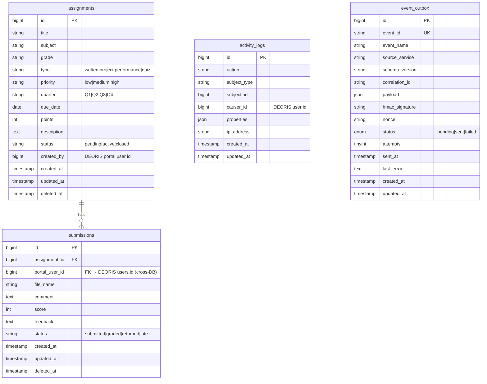

# ERD — taskflow (deoris_taskflow)

## Database Info
| Property | Value |
|---|---|
| **Database Name** | `deoris_taskflow` |
| **Connection** | MySQL / 127.0.0.1:3306 |
| **App URL** | https://taskflow.deoris.test |
| **Role** | Assignment & Submission Management |

## Cross-DB Links
| Field | References |
|---|---|
| `submissions.portal_user_id` | `deoris_identity_db.users.id` (student submitting) |
| `assignments.created_by` | `deoris_identity_db.users.id` (instructor creating) |
| `event_outbox` → DEORIS | `deoris_identity_db.event_logs` via HTTP POST |

## Notes
- No local users table — fully relies on DEORIS SSO for identity
- `portal_user_id` is the DEORIS user ID stored directly on submissions
- Soft deletes on both `assignments` and `submissions`
