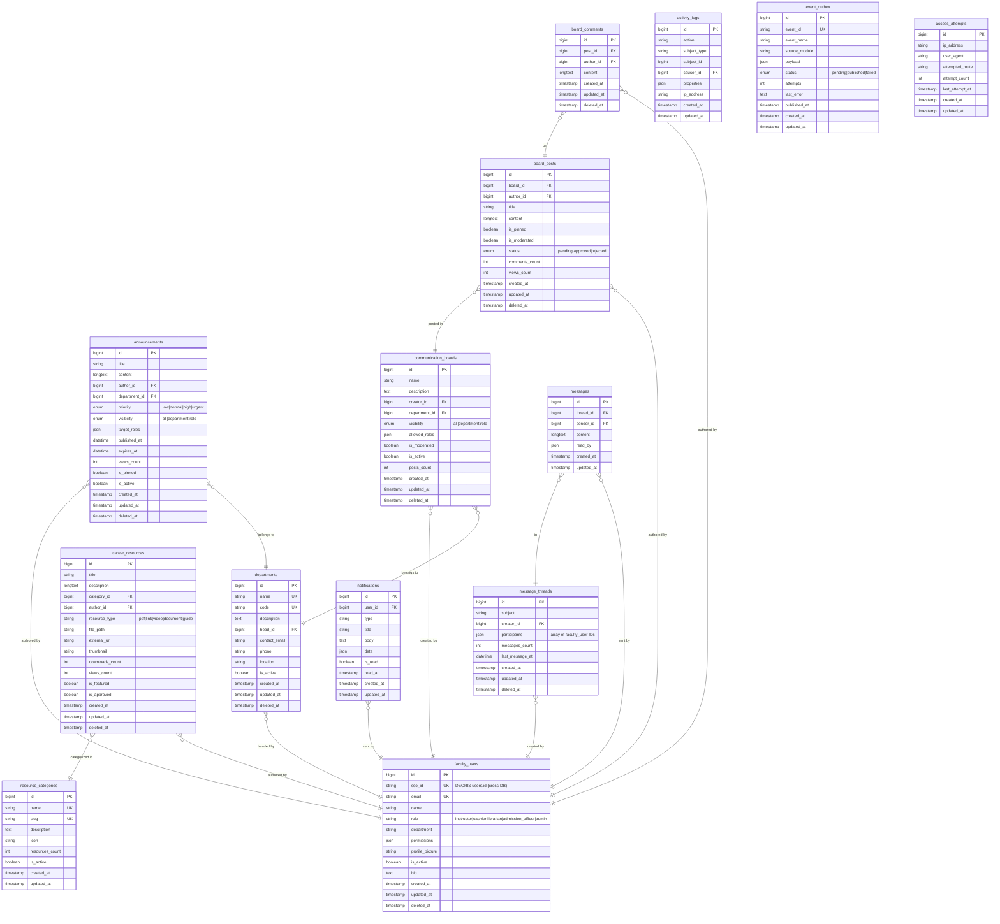

# ERD — carrerConnect / CareerConnect (careerconnect)

## Database Info
| Property | Value |
|---|---|
| **Database Name** | `careerconnect` |
| **Connection** | MySQL / 127.0.0.1:3306 |
| **App URL** | https://careerconnect.deoris.test |
| **Role** | Faculty Communication & Career Resources |

## Cross-DB Links
| Field | References |
|---|---|
| `faculty_users.sso_id` | `deoris_identity_db.users.id` (SSO identity) |
| `event_outbox` → DEORIS | `deoris_identity_db.event_logs` via HTTP POST |

## Notes
- `faculty_users` is a local mirror of DEORIS users with role = instructor/admin/etc.
- Synced via SSO token validation on login
- No student-facing tables — this module is faculty/staff only
