# ERD — DEORIS Whole System Overview (All 11 Databases)

This diagram shows the **cross-database relationships** between all modules. Each box represents a key table in its respective database. Dashed/logical links represent application-level foreign keys (no DB-enforced FK constraint across databases).

```mermaid
erDiagram
    %% ══════════════════════════════════════════════════════
    %% DEORIS MAIN — deoris_identity_db
    %% ══════════════════════════════════════════════════════
    DEORIS_users {
        bigint id PK
        string name
        string email UK
        string student_number UK
        enum role "admin|student|instructor|cashier|librarian|admission_officer|nurse|election_officer|candidate"
        enum admission_status "pending|approved|rejected|under_review"
        enum enrollment_status "not_enrolled|enrolled"
        boolean clearcheck_passed
        bigint enrollease_enrollment_id
    }

    DEORIS_event_logs {
        bigint id PK
        string event_id UK
        string event_name
        string source_module
        json payload
        string status
    }

    DEORIS_service_registry {
        bigint id PK
        string service_key UK
        string url
        enum status "active|inactive|degraded|maintenance"
    }

    DEORIS_notifications {
        uuid id PK
        string notifiable_type
        bigint notifiable_id
        string source_module
        string title
        timestamp read_at
    }

    %% ══════════════════════════════════════════════════════
    %% entryEase — SQLite
    %% ══════════════════════════════════════════════════════
    EE_applicants {
        bigint id PK
        bigint deoris_user_id "→ DEORIS_users.id"
        string grade_level
        enum status "Pending|Under Review|Approved|Rejected"
        enum admission_status "pending|approved|rejected"
    }

    EE_exam_schedules {
        bigint id PK
        string title
        date exam_date
        enum status "upcoming|ongoing|completed|cancelled"
    }

    EE_exam_attempts {
        bigint id PK
        bigint applicant_id FK
        bigint exam_schedule_id FK
        decimal score
        enum status "in_progress|submitted"
    }

    EE_event_outbox {
        bigint id PK
        string event_name
        string source_module
        json payload
        enum status "pending|published|failed"
    }

    %% ══════════════════════════════════════════════════════
    %% EnrollEase — enrolldb
    %% ══════════════════════════════════════════════════════
    ENR_enrollments {
        bigint id PK
        bigint student_id FK
        string email
        tinyint grade_level
        string school_year
        bigint room_id FK
        enum status "pending|reviewing|approved|rejected|enrolled|cancelled"
    }

    ENR_students {
        bigint id PK
        string email UK
        string lrn UK
        string student_name
    }

    ENR_rooms {
        bigint id PK
        string name
        tinyint grade_level
        string section
    }

    ENR_event_outbox {
        bigint id PK
        string event_name
        string source_module
        json payload
        enum status "pending|published|failed|cancelled"
    }

    %% ══════════════════════════════════════════════════════
    %% gradeTrack — gradetrack
    %% ══════════════════════════════════════════════════════
    GT_students {
        bigint id PK
        bigint portal_user_id "→ DEORIS_users.id"
        string student_id UK
        string email UK
    }

    GT_enrollments {
        bigint id PK
        bigint student_id FK
        bigint course_id FK
        bigint semester_id FK
    }

    GT_grades {
        bigint id PK
        bigint enrollment_id FK
        decimal final_grade
        enum status "draft|submitted|published|reopened"
    }

    GT_clearance_status_cache {
        bigint id PK
        bigint student_id FK
        boolean cleared_for_release
    }

    %% ══════════════════════════════════════════════════════
    %% asssesspay — assespaydb
    %% ══════════════════════════════════════════════════════
    AP_students {
        bigint id PK
        string portal_user_id "→ DEORIS_users.id"
        string student_id UK
    }

    AP_billings {
        bigint id PK
        bigint student_id FK
        string school_year
        decimal total_fee
        decimal balance
        enum status "unpaid|partial|paid"
    }

    AP_payments {
        bigint id PK
        bigint student_id FK
        decimal amount
        enum status "pending|paid|overdue|cancelled"
        string submitted_by_portal_id "→ DEORIS_users.id"
    }

    AP_event_outbox {
        uuid id PK
        string event_name
        json payload
        enum status "pending|published|failed"
    }

    %% ══════════════════════════════════════════════════════
    %% ClearCheck — cleardb
    %% ══════════════════════════════════════════════════════
    CC_students {
        bigint id PK
        bigint user_id "→ DEORIS_users.id"
        string reg_no UK
        enum clearance_status "pending|in_progress|completed|rejected"
    }

    CC_clearance_records {
        bigint id PK
        bigint student_id FK
        enum status "pending|validating|partially_cleared|cleared|disputed|expired"
        tinyint progress_percentage
    }

    CC_module_validations {
        bigint id PK
        bigint clearance_record_id FK
        string module_key "enrollease|assesspay|librarysys|gradetrack"
        enum status "pending|cleared|failed|error|timeout"
    }

    %% ══════════════════════════════════════════════════════
    %% LibrarySys — library
    %% ══════════════════════════════════════════════════════
    LIB_books {
        bigint id PK
        string title
        string isbn UK
        int available_copies
    }

    LIB_transactions {
        bigint id PK
        bigint deoris_user_id "→ DEORIS_users.id"
        bigint book_id FK
        date due_date
        string status "borrowed|returned|overdue"
    }

    LIB_penalties {
        bigint id PK
        bigint transaction_id FK
        bigint deoris_user_id "→ DEORIS_users.id"
        decimal amount
        enum status "unpaid|paid|waived"
    }

    %% ══════════════════════════════════════════════════════
    %% MediTrack — meditrack_db
    %% ══════════════════════════════════════════════════════
    MT_students {
        bigint id PK
        string external_id UK "→ DEORIS_users.id"
        string student_number UK
    }

    MT_clinic_visits {
        bigint id PK
        bigint student_id FK
        bigint nurse_id FK
        string severity
        string status
    }

    MT_deoris_event_inbox {
        bigint id PK
        uuid event_id UK
        string event_name
        string source_module
        string status
    }

    %% ══════════════════════════════════════════════════════
    %% VoteSys — votesys_db
    %% ══════════════════════════════════════════════════════
    VS_elections {
        bigint id PK
        string name
        string status "draft|open|voting|closed|results_released"
        boolean is_active
    }

    VS_votes {
        bigint id PK
        bigint election_id FK
        bigint candidate_id FK
        string voter_external_id "→ DEORIS_users.id"
    }

    VS_student_voters {
        bigint id PK
        string external_id UK "→ DEORIS_users.id"
        boolean is_eligible
    }

    %% ══════════════════════════════════════════════════════
    %% taskflow — deoris_taskflow
    %% ══════════════════════════════════════════════════════
    TF_assignments {
        bigint id PK
        string title
        string subject
        string grade
        bigint created_by "→ DEORIS_users.id"
    }

    TF_submissions {
        bigint id PK
        bigint assignment_id FK
        bigint portal_user_id "→ DEORIS_users.id"
        int score
        string status
    }

    %% ══════════════════════════════════════════════════════
    %% carrerConnect — careerconnect
    %% ══════════════════════════════════════════════════════
    CAR_faculty_users {
        bigint id PK
        string sso_id UK "→ DEORIS_users.id"
        string role
        string department
    }

    CAR_announcements {
        bigint id PK
        bigint author_id FK
        string title
        enum priority "low|normal|high|urgent"
    }

    CAR_career_resources {
        bigint id PK
        bigint author_id FK
        string title
        string resource_type
    }

    %% ══════════════════════════════════════════════════════
    %% CROSS-DATABASE RELATIONSHIPS (application-level)
    %% ══════════════════════════════════════════════════════

    DEORIS_users ||--o{ EE_applicants : "applies (deoris_user_id)"
    DEORIS_users ||--o{ GT_students : "linked (portal_user_id)"
    DEORIS_users ||--o{ AP_students : "linked (portal_user_id)"
    DEORIS_users ||--o{ CC_students : "linked (user_id)"
    DEORIS_users ||--o{ LIB_transactions : "borrows (deoris_user_id)"
    DEORIS_users ||--o{ LIB_penalties : "penalized (deoris_user_id)"
    DEORIS_users ||--o{ MT_students : "linked (external_id)"
    DEORIS_users ||--o{ VS_student_voters : "votes (external_id)"
    DEORIS_users ||--o{ VS_votes : "casts (voter_external_id)"
    DEORIS_users ||--o{ TF_submissions : "submits (portal_user_id)"
    DEORIS_users ||--o{ TF_assignments : "creates (created_by)"
    DEORIS_users ||--o{ CAR_faculty_users : "mirrored (sso_id)"

    DEORIS_users ||--o{ DEORIS_notifications : "receives"
    DEORIS_event_logs ||--o{ DEORIS_notifications : "triggers"

    EE_event_outbox }o--|| DEORIS_event_logs : "publishes to EventHub"
    ENR_event_outbox }o--|| DEORIS_event_logs : "publishes to EventHub"
    AP_event_outbox }o--|| DEORIS_event_logs : "publishes to EventHub"
    MT_deoris_event_inbox }o--|| DEORIS_event_logs : "receives from EventHub"

    ENR_enrollments ||--o{ GT_enrollments : "synced to gradeTrack"
    ENR_enrollments ||--o{ AP_billings : "triggers billing"
    ENR_enrollments }o--|| DEORIS_users : "updates enrollment_status"

    CC_module_validations }o--|| ENR_enrollments : "validates (enrollease)"
    CC_module_validations }o--|| AP_billings : "validates (assesspay)"
    CC_module_validations }o--|| LIB_transactions : "validates (librarysys)"
    CC_module_validations }o--|| GT_clearance_status_cache : "validates (gradetrack)"
    CC_clearance_records }o--|| DEORIS_users : "updates clearcheck_passed"

    EE_applicants ||--o{ EE_exam_schedules : "assigned to"
    EE_applicants ||--o{ EE_exam_attempts : "takes"

    ENR_students ||--o{ ENR_enrollments : "has"
    ENR_rooms ||--o{ ENR_enrollments : "contains"

    GT_students ||--o{ GT_enrollments : "has"
    GT_enrollments ||--o{ GT_grades : "has"
    GT_students ||--o{ GT_clearance_status_cache : "has"

    AP_students ||--o{ AP_billings : "has"
    AP_students ||--o{ AP_payments : "makes"

    LIB_books ||--o{ LIB_transactions : "borrowed in"
    LIB_transactions ||--o{ LIB_penalties : "generates"

    MT_students ||--o{ MT_clinic_visits : "has"

    VS_elections ||--o{ VS_votes : "contains"
    VS_student_voters ||--o{ VS_votes : "casts"

    TF_assignments ||--o{ TF_submissions : "has"

    CAR_faculty_users ||--o{ CAR_announcements : "authors"
    CAR_faculty_users ||--o{ CAR_career_resources : "creates"
```



---

## System Architecture Summary

### Database Registry

| # | Module | Database Name | Connection | URL |
|---|---|---|---|---|
| 0 | **DEORIS (Main Portal)** | `deoris_identity_db` | MySQL | https://deoris.test |
| 1 | **entryEase** | `SQLite` (dev) | SQLite | https://entryease.deoris.test |
| 2 | **EnrollEase** | `enrolldb` | MySQL | https://enrollease.deoris.test |
| 3 | **gradeTrack** | `gradetrack` | MySQL | https://gradetrack.deoris.test |
| 4 | **asssesspay** | `assespaydb` | MySQL | https://assesspay.deoris.test |
| 5 | **ClearCheck** | `cleardb` | MySQL | https://clearcheck.deoris.test |
| 6 | **LibrarySys** | `library` | MySQL | https://librarysys.deoris.test |
| 7 | **MediTrack** | `meditrack_db` | MySQL | https://meditrack.deoris.test |
| 8 | **VoteSys** | `votesys_db` | MySQL | https://votesys.deoris.test |
| 9 | **taskflow** | `deoris_taskflow` | MySQL | https://taskflow.deoris.test |
| 10 | **carrerConnect** | `careerconnect` | MySQL | https://careerconnect.deoris.test |

---

### Student Lifecycle Flow

```
[entryEase] → Applicant applies → Exam taken → Admission approved
      ↓ (EventHub: admission.approved)
[DEORIS] → users.admission_status = 'approved'
      ↓
[EnrollEase] → Student enrolls → enrollment.status = 'enrolled'
      ↓ (EventHub: enrollment.enrolled)
[DEORIS] → users.enrollment_status = 'enrolled'
      ↓
[asssesspay] → Billing created → Payment processed
[gradeTrack] → Student enrolled in courses → Grades recorded
[LibrarySys] → Student borrows books
[MediTrack]  → Student visits clinic
[taskflow]   → Student submits assignments
[VoteSys]    → Student votes in elections
      ↓
[ClearCheck] → Validates all 4 modules (EnrollEase, AssessPay, LibrarySys, GradeTrack)
      ↓ (EventHub: clearance.cleared)
[DEORIS] → users.clearcheck_passed = true
```

---

### EventHub Integration Pattern

All modules communicate with DEORIS via the **EventHub** pattern:

1. **Outbound**: Module writes to its local `event_outbox` table
2. **Publish**: Background job POSTs to `https://deoris.test/api/events/ingest`
3. **Ingest**: DEORIS validates HMAC signature, writes to `event_logs`
4. **Process**: DEORIS dispatches `ProcessEcosystemEvent` job
5. **Notify**: DEORIS creates `notifications` for affected users
6. **Sync**: DEORIS updates `users` table fields (admission_status, enrollment_status, clearcheck_passed)

---

### Identity Pattern

DEORIS is the **single source of truth** for user identity. Modules use one of these patterns:

| Pattern | Modules | How |
|---|---|---|
| **SSO Token** | All modules | JWT/token validated against `https://deoris.test` |
| **deoris_user_id column** | entryEase, LibrarySys, taskflow | Store DEORIS `users.id` directly |
| **external_id column** | MediTrack, VoteSys | Store DEORIS `users.id` as string |
| **portal_user_id column** | gradeTrack, asssesspay | Store DEORIS `users.id` |
| **sso_id column** | carrerConnect | Store DEORIS `users.id` |
| **user_id column** | ClearCheck | Was local FK, migrated to DEORIS id |
| **Dropped local users** | LibrarySys, MediTrack, VoteSys, ClearCheck | Local `users` table dropped |
