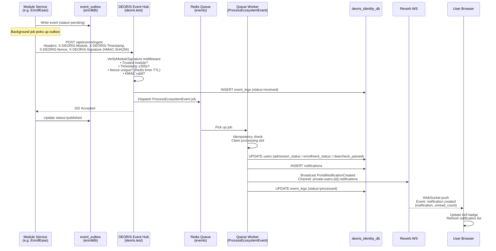
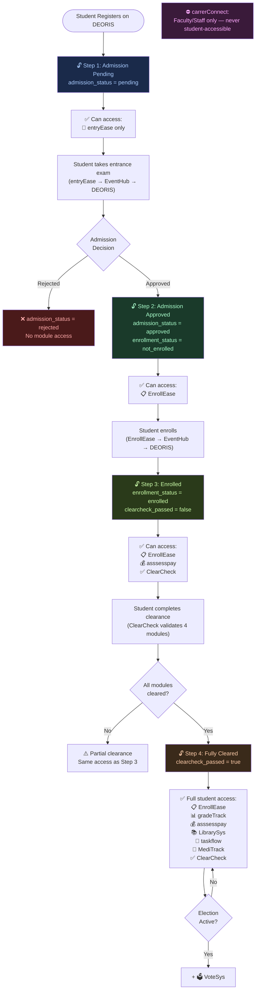
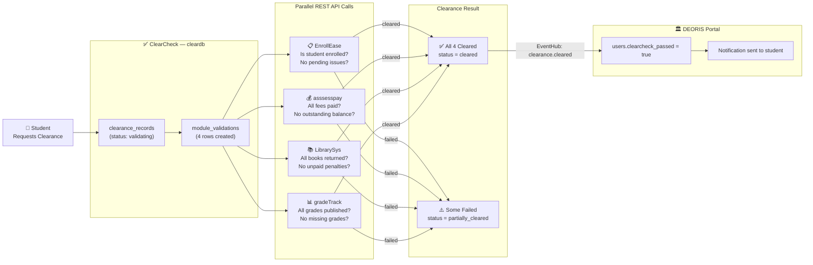
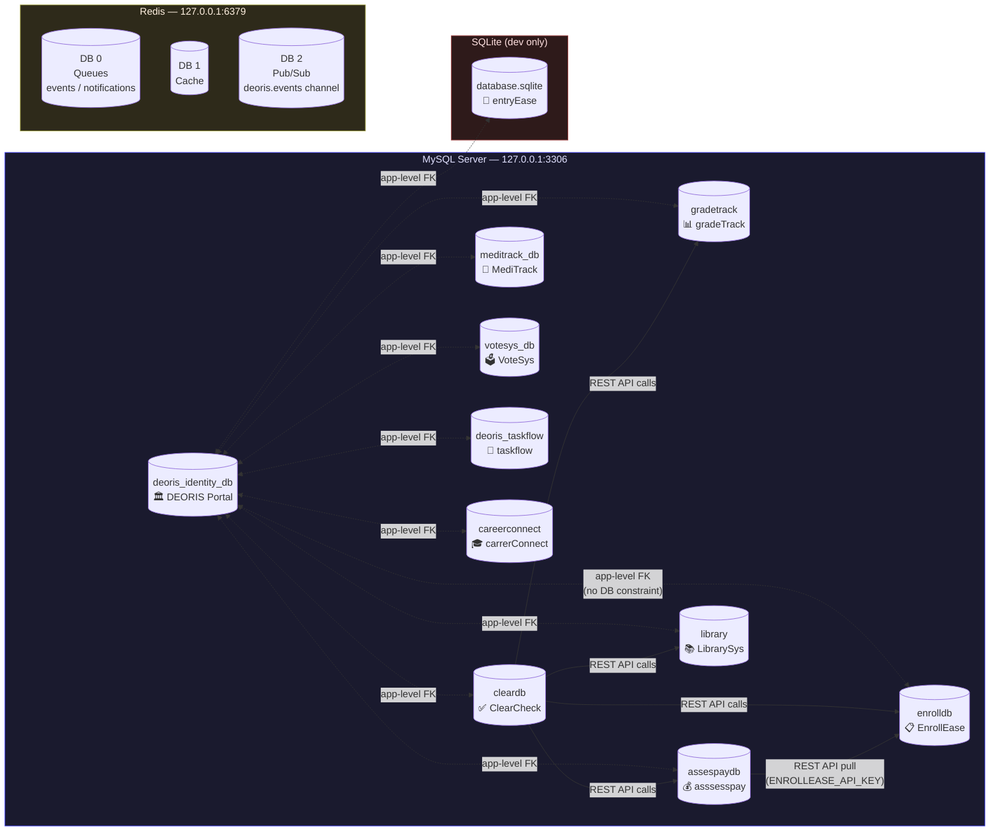
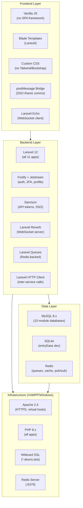
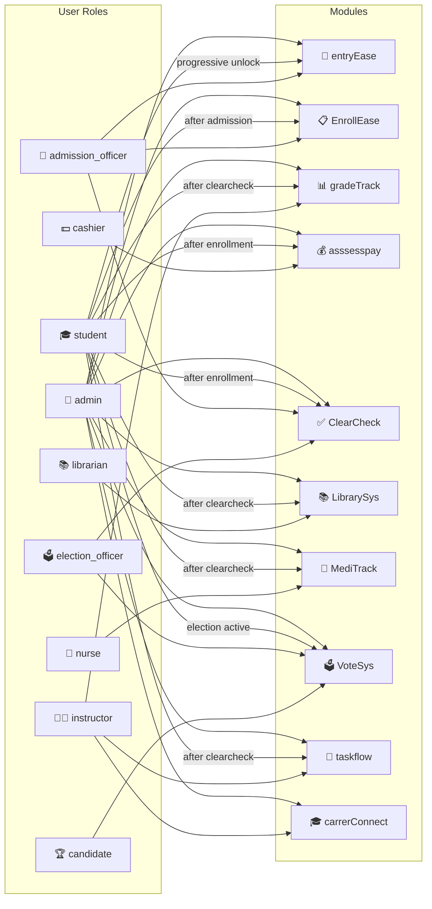

# DEORIS — System Architecture Diagram

## 1. High-Level System Overview

```mermaid
graph TB
    subgraph BROWSER["🌐 Client Browser"]
        UI["Portal Shell UI\n(homepage.blade.php)"]
        IFRAME["Module iframes\n(embedded modules)"]
        WS_CLIENT["WebSocket Client\n(portal-notifications.js)"]
    end

    subgraph DEORIS_PORTAL["🏛️ DEORIS Core Portal — deoris.test"]
        direction TB
        subgraph PORTAL_LAYERS["Core Services"]
            AUTH["🔐 Auth / Identity\n(Fortify + Jetstream)"]
            SSO["🎫 SSO Broker\n(Sanctum single-use tokens)"]
            GATEWAY["🔀 API Gateway\n(/api/v1/gateway/{module})"]
            EVENTHUB["📡 Event Hub\n(HTTP ingest + Redis Pub/Sub)"]
            NOTIF["🔔 Notification Hub\n(Reverb WebSockets)"]
            SEARCH["🔍 Federated Search\n(parallel HTTP pool)"]
            REGISTRY["📋 Service Registry\n(health checks)"]
            RBAC["🛡️ RBAC + Module Guard\n(9 roles, progressive unlock)"]
        end

        subgraph PORTAL_DB["Portal Database — deoris_identity_db"]
            DB_USERS[("users\n(identity + status)")]
            DB_EVENTS[("event_logs\n(audit trail)")]
            DB_NOTIFS[("notifications\n(inbox)")]
            DB_REGISTRY[("service_registry")]
            DB_TOKENS[("personal_access_tokens\n(SSO tokens)")]
            DB_SESSIONS[("sessions")]
        end

        subgraph PORTAL_INFRA["Infrastructure"]
            REDIS_QUEUE[("Redis DB:0\nQueue: events")]
            REDIS_CACHE[("Redis DB:1\nCache")]
            REDIS_PUBSUB[("Redis DB:2\nPub/Sub: deoris.events")]
            REVERB["Reverb WS Server\n:8081"]
            QUEUE_WORKER["Queue Worker\n(ProcessEcosystemEvent)"]
        end
    end

    subgraph MODULES["📦 Module Services (each on own subdomain + DB)"]
        direction LR
        M1["📝 entryEase\nentryease.deoris.test\nSQLite"]
        M2["📋 EnrollEase\nenrollease.deoris.test\nenrolldb"]
        M3["📊 gradeTrack\ngradetrack.deoris.test\ngradetrack"]
        M4["💰 asssesspay\nassessepay.deoris.test\nassespaydb"]
        M5["✅ ClearCheck\nclearcheck.deoris.test\ncleardb"]
        M6["📚 LibrarySys\nlibrarysys.deoris.test\nlibrary"]
        M7["🏥 MediTrack\nmeditrack.deoris.test\nmeditrack_db"]
        M8["🗳️ VoteSys\nvotesys.deoris.test\nvotesys_db"]
        M9["📌 taskflow\ntaskflow.deoris.test\ndeoris_taskflow"]
        M10["🎓 carrerConnect\ncareerconnect.deoris.test\ncareerconnect"]
    end

    %% Browser ↔ Portal
    UI -->|"HTTPS requests"| AUTH
    UI -->|"postMessage bridge"| SSO
    WS_CLIENT <-->|"WSS :8081"| REVERB
    IFRAME <-->|"postMessage (SSO)"| SSO

    %% Portal internal
    AUTH --> DB_USERS
    AUTH --> DB_SESSIONS
    SSO --> DB_TOKENS
    GATEWAY --> RBAC
    EVENTHUB --> DB_EVENTS
    EVENTHUB --> REDIS_QUEUE
    EVENTHUB --> REDIS_PUBSUB
    NOTIF --> DB_NOTIFS
    NOTIF --> REVERB
    REGISTRY --> DB_REGISTRY
    QUEUE_WORKER --> REDIS_QUEUE
    QUEUE_WORKER --> DB_NOTIFS
    QUEUE_WORKER --> DB_USERS
    QUEUE_WORKER --> REVERB
    REDIS_PUBSUB --> QUEUE_WORKER

    %% Portal → Modules (SSO + Gateway)
    SSO -->|"identity token"| M1
    SSO -->|"identity token"| M2
    SSO -->|"identity token"| M3
    SSO -->|"identity token"| M4
    SSO -->|"identity token"| M5
    SSO -->|"identity token"| M6
    SSO -->|"identity token"| M7
    SSO -->|"identity token"| M8
    SSO -->|"identity token"| M9
    SSO -->|"identity token"| M10

    %% Modules → EventHub
    M1 -->|"POST /api/events\n(HMAC signed)"| EVENTHUB
    M2 -->|"POST /api/events\n(HMAC signed)"| EVENTHUB
    M3 -->|"POST /api/events\n(HMAC signed)"| EVENTHUB
    M4 -->|"POST /api/events\n(HMAC signed)"| EVENTHUB
    M5 -->|"POST /api/events\n(HMAC signed)"| EVENTHUB
    M6 -->|"POST /api/events\n(HMAC signed)"| EVENTHUB
    M7 -->|"POST /api/events\n(HMAC signed)"| EVENTHUB
    M8 -->|"POST /api/events\n(HMAC signed)"| EVENTHUB
    M9 -->|"POST /api/events\n(HMAC signed)"| EVENTHUB
    M10 -->|"POST /api/events\n(HMAC signed)"| EVENTHUB

    %% Search
    SEARCH -->|"GET /api/search\n(Bearer token)"| M1
    SEARCH -->|"GET /api/search\n(Bearer token)"| M2
    SEARCH -->|"GET /api/search\n(Bearer token)"| M3

    %% ClearCheck → Modules (validation queries)
    M5 -->|"REST API validation"| M2
    M5 -->|"REST API validation"| M4
    M5 -->|"REST API validation"| M6
    M5 -->|"REST API validation"| M3

    style DEORIS_PORTAL fill:#1a1a2e,color:#e0e0ff,stroke:#4a4aff
    style BROWSER fill:#0d2137,color:#e0f0ff,stroke:#2a6aaa
    style MODULES fill:#1a2e1a,color:#e0ffe0,stroke:#4aaa4a
    style PORTAL_LAYERS fill:#2a2a4e,color:#e0e0ff,stroke:#6a6aff
    style PORTAL_DB fill:#2e1a2e,color:#ffe0ff,stroke:#aa4aaa
    style PORTAL_INFRA fill:#2e2a1a,color:#fff0e0,stroke:#aaaa4a
```



---

## 2. SSO Authentication Flow

```mermaid
sequenceDiagram
    actor User
    participant Browser
    participant Portal as DEORIS Portal<br/>(deoris.test)
    participant Module as Module Service<br/>(e.g. enrollease.deoris.test)

    User->>Browser: Navigate to portal
    Browser->>Portal: GET https://deoris.test/login
    User->>Portal: Submit credentials
    Portal->>Portal: Fortify authenticates<br/>Creates encrypted session
    Portal-->>Browser: Set deoris_identity_session cookie<br/>(SameSite=None; Secure; Domain=.deoris.test)
    Browser-->>User: Dashboard loaded

    Note over Browser,Module: User clicks module tab → iframe loads

    Browser->>Module: Load iframe src=https://enrollease.deoris.test?embedded=1
    Module-->>Browser: module-bridge.js loaded

    Browser->>Portal: postMessage REQUEST_SSO {requestId}
    Note over Portal: Validates origin (exact match whitelist)
    Portal->>Portal: GET /api/v1/sso/token<br/>Revoke old SSO tokens<br/>Issue new single-use Sanctum token
    Portal-->>Browser: postMessage SSO_TOKEN {token, requestId}

    Browser->>Module: POST /api/v1/sso/exchange {token}
    Module->>Portal: Validate token (TokenValidator)
    Note over Portal: Verify ability='sso'<br/>DELETE token immediately (single-use)
    Portal-->>Module: {id, name, email, role, student_number, ...}
    Module-->>Browser: window.PORTAL_USER set<br/>module:ready dispatched
    Browser-->>User: Module UI rendered with identity
```

---

## 3. Event Hub Flow



---

## 4. Student Progressive Access Flow



---

## 5. ClearCheck Multi-Module Validation Flow



---

## 6. Database Topology



---

## 7. Technology Stack



---

## 8. Role → Module Access Matrix



---

## Summary Table

| Component | Technology | Purpose |
|---|---|---|
| **Portal Framework** | Laravel 12 | All 11 apps |
| **Authentication** | Fortify + Jetstream | Login, 2FA, profile |
| **API Tokens** | Sanctum | SSO single-use tokens |
| **SSO Mechanism** | postMessage + Sanctum | iframe identity handoff |
| **WebSockets** | Laravel Reverb | Real-time notifications |
| **Event Bus** | Redis Pub/Sub + HTTP | Cross-module events |
| **Queue** | Redis (DB:0) | Async event processing |
| **Cache** | Redis (DB:1) | Search results, sessions |
| **Main DB** | MySQL `deoris_identity_db` | Users, events, notifications |
| **Module DBs** | MySQL (9) + SQLite (1) | Per-module business data |
| **Web Server** | Apache 2.4 (XAMPP) | HTTPS virtual hosts |
| **Event Security** | HMAC-SHA256 | Signed event envelopes |
| **Identity Pattern** | Cross-DB user ID reference | No shared DB, app-level FK |
| **Clearance** | ClearCheck REST queries | 4-module validation |
